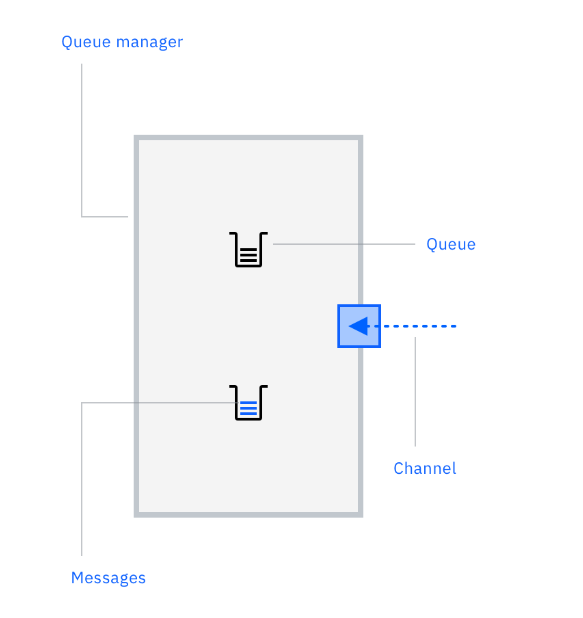
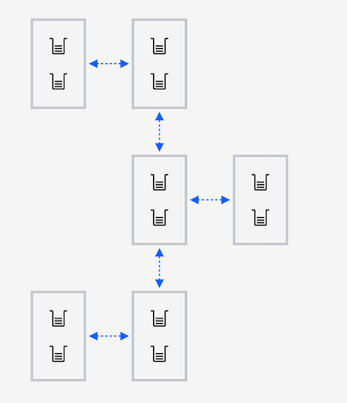
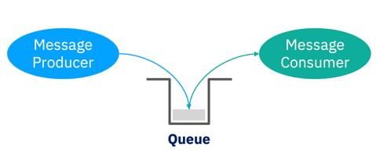
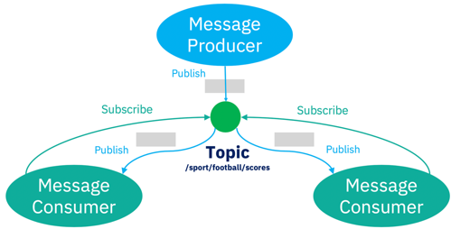
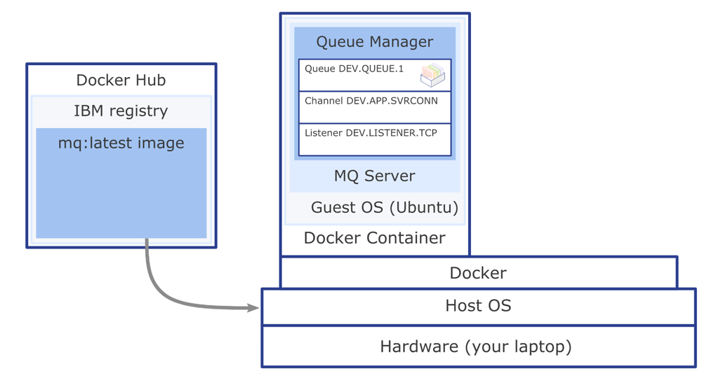

# Database

## Build Image

`docker build -t docker-my-sql-local-image .`

## Run Container

`docker run --name docker-my-sql-local-container -p 3306:3306 --env MYSQL_ROOT_PASSWORD=root docker-my-sql-local-image`

## Stop Container

`docker stop docker-my-sql-local-container`

## Remove Container

`docker rm docker-my-sql-local-container`

## Remove Image

`docker rmi docker-my-sql-local-image`

# IBM MQ

https://developer.ibm.com/learningpaths/ibm-mq-badge

## Messaging Fundamentals

1. Messages are packages of data that are produced and consumed by applications.
   
2. Queues are addressable locations to deliver messages to and store them reliably until they need to be consumed.
3. Queue managers are the MQ servers that host the queues and topic.
4. Channels are the way queue managers communicate with each other and with the applications.
   
5. MQ networks are loose collections of interconnected queue managers, all working together to deliver messages between applications and locations.
   
6. MQ clusters are tight couplings of queue managers, enabling higher levels of scaling and availability.
   

## IBM MQ messaging styles

1. Point-to-point messaging : In point-to-point, message producers are called senders and message consumers are called receivers. Senders produce messages to a queue, and receivers asynchronously consume messages from that queue.
   

> For point-to-point to work, connected applications need to know the name of the queue through which they interact.
> A queue could have a single receiver or be scaled to many, in which case each message is only consumed by one receiver, distributing the workload across them all.

2. Publish/subscribe messaging: The producer of a message is known as a publisher, and message consumers are known as subscribers. The publishing and subscribing applications within the infrastructure agree on the name of a topic. For a consumer to signal that they want to receive messages on that topic, they create a subscription to it.
   

> Any message published to a topic will be delivered to all the subscriptions, so every subscriber gets a copy. There could be many publishers and many subscribers to each topic, MQ handles the delivery of messages between all of them. A durable subscriber is a message consumer that receives all messages published on a topic, including messages published while the subscriber is disconnected from MQ.

# IBM MQ Docker Container

## Custom Configuration

IBM MQ Configuration : mq-config.mqsc

## Build Image

`docker build -t docker-ibm-mq-local-image .`

## Create Volume

`docker volume create qm1data`

## Create Container from Image docker-ibm-mq-local

`docker run --name docker-ibm-mq-local-container --env LICENSE=accept --env MQ_QMGR_NAME=QM1 --volume qm1data:/mnt/mqm --publish 1414:1414 --publish 9443:9443 --env MQ_APP_PASSWORD=passw0rd docker-ibm-mq-local-image`

1. --env LICENSE=accept (Accepting the license)
2. --env MQ_QMGR_NAME=QM1 (Creating queue manager QM1)
3. --volume qm1data:/mnt/mqm (Associating volume qm1data to drive associated to container)
4. --publish 1414:1414 (Port 1414 to which application can connect)
5. --publish 9443:9443 (Port 9443 to which MQ Console is available : https://localhost:9443/ibmmq/console username is admin and password is passw0rd)
6. --detach (Running in background)
7. --env MQ_APP_PASSWORD=passw0rd (Setting password for application to connect)

## Docker Commands

1. docker ps (List down the containers)
2. docker exec -it [containerid] bash (Execute command inside container interactively)
   > dspmqver (Display MQ Version), dspmq (Running Queue Manager)

## Configuration for Spring Application

ibm.mq.queueManager=QM1
ibm.mq.channel=DEV.ADMIN.SVRCONN
ibm.mq.connName=localhost(1414)
ibm.mq.user=admin
ibm.mq.password=passw0rd
